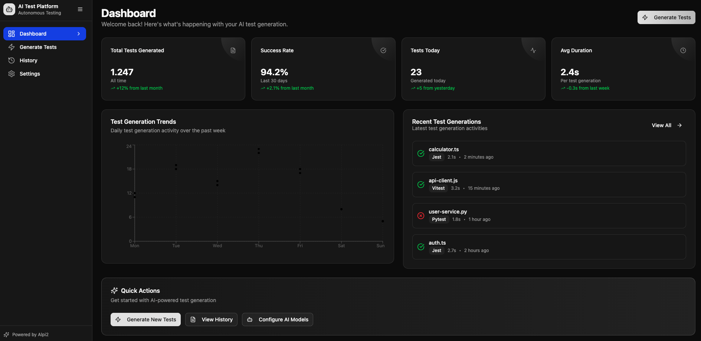

# KI-gestützte Plattform zur autonomen Testgenerierung

## Über das Projekt

Die "KI-gestützte Plattform zur autonomen Testgenerierung" ist ein innovatives Projekt, das darauf abzielt, Softwareentwicklungsprozesse durch Automatisierung grundlegend zu verändern. Diese Plattform analysiert den Quellcode und nutzt führende KI-Modelle sowie intelligente Agentenarchitekturen, um automatisch hochwertige Unit-, Integrations- und UI-Tests zu generieren. Unser Ziel ist es, die Belastung durch das Schreiben von Tests zu verringern, Entwicklungszyklen zu beschleunigen und die Softwarequalität kontinuierlich zu verbessern.

Durch die Minimierung der Abhängigkeit von Cloud-basierten APIs bietet dieses Projekt eine vollständig lokale, datenschutzfreundliche und Docker-isolierte Lösung.

## Hauptfunktionen

- **Intelligente Testgenerierung**: KI-gestützte automatische Testcode-Generierung basierend auf Codeanalyse.

- **Unterstützung mehrerer Test-Frameworks**: Unterstützt beliebte Test-Frameworks wie Jest, Vitest, Mocha, Cypress und Playwright.

- **Lokale KI-Integration**: Führt Open-Source-Sprachmodelle wie LLaMA, Mistral, Deepseek in lokalen Docker-Containern aus.

- **Optionale Cloud-Modell-Integration**: Standardmäßig vollständig lokal, mit optionaler Nutzung von Cloud-Modellen wie Grok oder Gemini zur Steigerung der Generierungsqualität.

- **Autonome Agentenarchitektur**: Agenten mit "Denken-Handeln-Beobachten"-Schleife, die mit Tools wie Lintern oder Test Runnern interagieren können.

- **Docker-Isolation**: Alle Dienste (KI-Modelle, Agenten, Analysetools) laufen isoliert in Containern – für einfache Einrichtung und Portabilität.

- **CLI und UI (optional)**: Schnelle Nutzung über Kommandozeile oder benutzerfreundliche Weboberfläche auf Basis von React.

- **Feedback-Schleife**: Führt generierte Tests automatisch aus, analysiert fehlgeschlagene Tests und verbessert sie mithilfe des KI-Agenten.

- **Datenschutz**: Alle Prozesse finden lokal statt – Ihre Daten und Ihr Code verlassen niemals Ihr System.

## Warum dieses Projekt?

Das Schreiben von Tests ist ein kritischer, aber zeitaufwändiger Bestandteil der Softwareentwicklung. Diese Plattform entlastet Entwickler, indem sie repetitive Aufgaben der Testgenerierung an KI übergibt, sodass sich diese auf komplexere Probleme konzentrieren können. Dank lokaler Ausführung eignet sich das System auch für sensible Codebasen.

## Technologischer Überblick

- **Backend**: Node.js (TypeScript), Express.js

- **KI-Dienste**: Python (FastAPI), llama.cpp (für GGUF-Modelle)

- **Containerisierung**: Docker, Docker Compose

- **Codeanalyse**: Esprima, SWC, TS-Morph

- **Testtools**: Jest, Vitest, Mocha, Cypress, Playwright

- **Datenbank**: MongoDB (lokal)

- **Auftragswarteschlange**: Redis, BullMQ

- **CLI**: Commander.js

- **UI**: React / Next.js (optional)

## 📸 Preview

<p align="center">
  
</p>

<p align="center">
  
</p>

<p align="center">
  
</p>

<p align="center">
  
</p>

<p align="center">
  
</p>

## ⚙️ Einrichtung (Schnellstart)

> Um das Projekt lokal auszuführen, müssen Docker und Docker Compose installiert sein.

```bash
# Repository klonen
git clone https://github.com/Alpi2/AutoCodeTest.git

# Benötigte KI-Modellgewichte in das Verzeichnis "models/" herunterladen
# (z. B. Mistral-7B-Instruct-v0.2 GGUF)

# Alle Dienste starten
docker-compose up --build -d

# Tests mit dem CLI-Tool generieren
npm run cli generate <dateipfad.ts>


```
