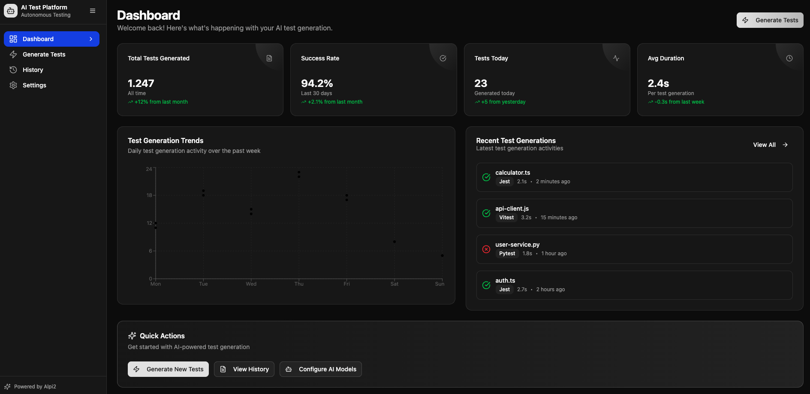
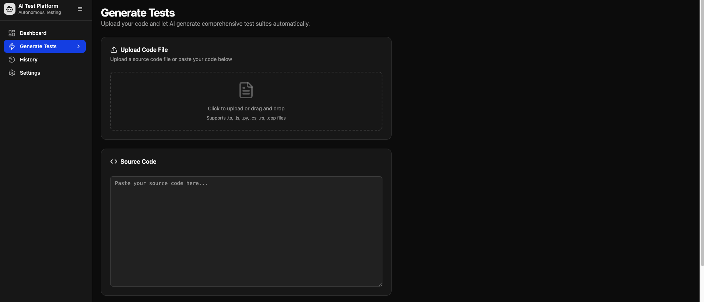
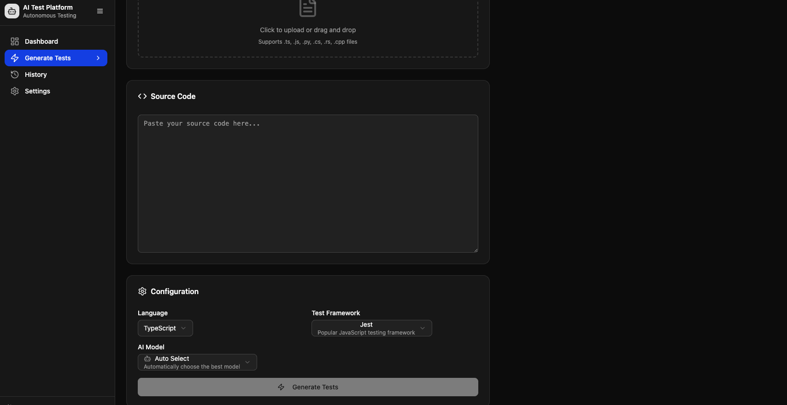
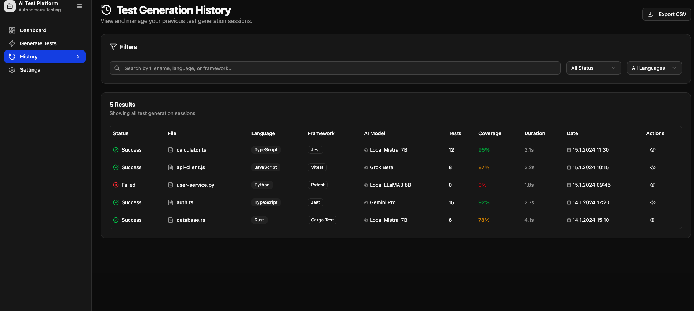
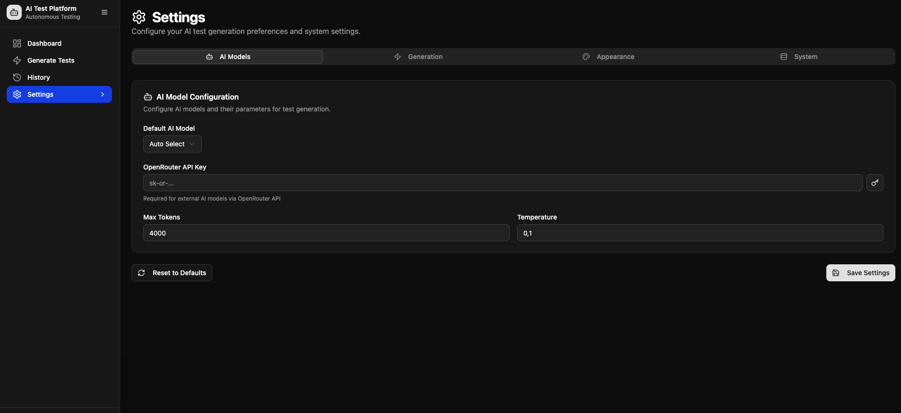

# AI-Powered Autonomous Test Generation Platform

## About The Project

The **AI-Powered Autonomous Test Generation Platform** is an innovative project aiming to revolutionize software development processes through automation. This platform analyzes your codebase and leverages leading artificial intelligence models and intelligent agent architectures to automatically generate high-quality unit, integration, and UI tests. Our goal is to alleviate the burden of test writing, accelerate development cycles, and continuously enhance software quality.

By minimizing reliance on cloud-based APIs, this project offers a secure and data-private, fully on-premise, and Docker-isolated solution.

---

## 🔑 Key Features

- **Intelligent Test Generation**: AI-driven automatic test code generation based on code analysis.

- **Multi-Test Framework Support**: Supports popular test frameworks like Jest, Vitest, Mocha, Cypress, Playwright.

- **Local AI Integration**: Runs open-source Large Language Models (LLMs) such as LLaMA, Mistral, Deepseek within local Docker containers.

- **Optional Cloud Integration**: Users can enable selected cloud-based models (e.g., Grok, Gemini) for enhanced generation accuracy — at their own discretion.

- **Autonomous Agent Architecture**: Intelligent agents utilizing a Thought-Action-Observation loop and capable of interacting with tools (linter, test runner).

- **Docker Isolation**: Every service (AI models, agents, analysis tools) runs completely isolated in Docker containers, ensuring easy setup and portability.

- **CLI and UI (Optional)**: Command-line interface for quick usage or a user-friendly React-based web interface.

- **Feedback Loop**: Automatically runs generated test code, analyzes failing tests, and directs the AI agent to refine the tests.

- **Data Privacy**: All operations occur on your local system; your code and data never leave your environment.

---

## 🎯 Why This Project?

In today's software landscape, test writing is a critical yet time-consuming part of the development process. This platform offloads repetitive test writing tasks to AI, allowing developers to focus on more complex problems. With its local operation principle, it can be securely used even with sensitive codebases.

---

## 🧠 Technology Overview

- **Backend**: Node.js (TypeScript), Express.js

- **AI Services**: Python (FastAPI), llama.cpp (for GGUF models)

- **Containerization**: Docker, Docker Compose

- **Code Analysis**: Esprima, SWC, TS-Morph

- **Testing Tools**: Jest, Vitest, Mocha, Cypress, Playwright

- **Database**: MongoDB (Local)

- **Job Queue**: Redis, BullMQ

- **CLI**: Commander.js

- **UI**: React / Next.js (Optional)

---

## 📸 Preview

<p align="center">
  
</p>

<p align="center">
  
</p>

<p align="center">
  
</p>

<p align="center">
  
</p>

<p align="center">
  
</p>
## ⚙️ Setup (Quick Start)

> To get the project running on your local machine, Docker and Docker Compose must be installed.

```bash
# Clone the repository
git clone https://github.com/Alpi2/AutoCodeTest.git

# Download necessary AI model weights into the models/ directory

# (e.g., Mistral-7B-Instruct-v0.2 GGUF)

# Start all services
docker-compose up --build -d

# Start generating tests using the CLI tool
npm run cli generate <file_path.ts>
```
