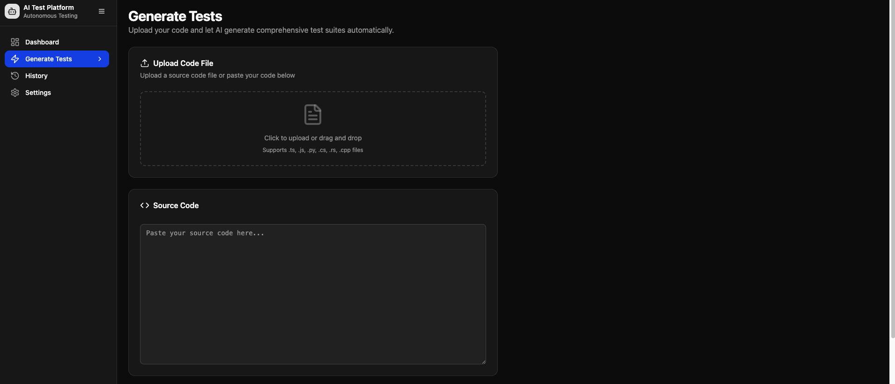

# Yapay Zeka Destekli Otonom Test Üretim Platformu

## Proje Hakkında

"Yapay Zeka Destekli Otonom Test Üretim Platformu", yazılım geliştirme süreçlerini otomasyon yoluyla devrim niteliğinde dönüştürmeyi amaçlayan yenilikçi bir projedir. Bu platform, kod tabanınızı analiz eder ve lider yapay zeka modelleri ile akıllı ajan mimarilerini kullanarak otomatik olarak yüksek kaliteli birim, entegrasyon ve UI testleri üretir. Amacımız, test yazma yükünü azaltmak, geliştirme döngülerini hızlandırmak ve yazılım kalitesini sürekli artırmaktır.

Bulut tabanlı API'lere olan bağımlılığı en aza indirerek, tamamen yerel, Docker ile izole edilmiş, güvenli ve veri gizliliğine önem veren bir çözüm sunar.

## Temel Özellikler

- **Akıllı Test Üretimi**: Kod analizine dayalı yapay zeka destekli otomatik test kodu üretimi.

- **Çoklu Test Çatısı Desteği**: Jest, Vitest, Mocha, Cypress, Playwright gibi popüler test çatılarının desteği.

- **Yerel Yapay Zeka Entegrasyonu**: LLaMA, Mistral, Deepseek gibi açık kaynaklı büyük dil modelleri yerel Docker konteynerlerinde çalışır.

- **İsteğe Bağlı Bulut Modeli Desteği**: İsteğe bağlı olarak Grok, Gemini gibi bulut modelleri etkinleştirilerek doğruluk artırılabilir.

- **Otonom Ajan Mimarisi**: Düşünce-Eylem-Gözlem döngüsünü kullanan ve araçlarla (linter, test çalıştırıcı) etkileşime girebilen zeki ajanlar.

- **Docker İzolasyonu**: Tüm servisler (AI modelleri, ajanlar, analiz araçları) izole şekilde Docker konteynerlerinde çalışır.

- **CLI ve (İsteğe Bağlı) UI**: Komut satırı arayüzü ve kullanıcı dostu bir React tabanlı web arayüzü.

- **Geri Bildirim Döngüsü**: Oluşturulan testler çalıştırılır, hatalı testler analiz edilir ve AI ajanı bu testleri iyileştirir.

- **Veri Gizliliği**: Tüm işlemler yerel sisteminizde gerçekleşir; kodlarınız veya verileriniz dış ortama çıkmaz.

## Neden Bu Proje?

Günümüz yazılım dünyasında test yazmak kritik fakat zaman alan bir süreçtir. Bu platform, tekrarlayan test yazma işlerini yapay zekaya devrederek geliştiricilerin daha karmaşık problemlere odaklanmasını sağlar. Yerel çalışma prensibi sayesinde hassas kod tabanlarında bile güvenle kullanılabilir.

## Teknoloji Genel Bakış

- **Backend**: Node.js (TypeScript), Express.js

- **AI Servisleri**: Python (FastAPI), llama.cpp (GGUF modelleri için)

- **Konteynerizasyon**: Docker, Docker Compose

- **Kod Analizi**: Esprima, SWC, TS-Morph

- **Test Araçları**: Jest, Vitest, Mocha, Cypress, Playwright

- **Veritabanı**: MongoDB (Yerel)

- **İş Kuyruğu**: Redis, BullMQ

- **CLI**: Commander.js

- **UI (İsteğe Bağlı)**: React / Next.js

## 📸 Preview

<p align="center">
  
</p>

<p align="center">
  
</p>

<p align="center">
  
</p>

<p align="center">
  
</p>

<p align="center">
  
</p>

## ⚙️ Kurulum (Hızlı Başlangıç)

> Bu projeyi yerel makinenizde çalıştırmak için Docker ve Docker Compose kurulu olmalıdır.

```bash
# Depoyu klonlayın
git clone https://github.com/Alpi2/AutoCodeTest.git

# Gerekli AI model dosyalarını "models/" dizinine indirin
# (örneğin: Mistral-7B-Instruct-v0.2 GGUF)

# Tüm servisleri başlatın
docker-compose up --build -d

# CLI aracı ile test üretimini başlatın
npm run cli generate <dosya_yolu.ts>

```
